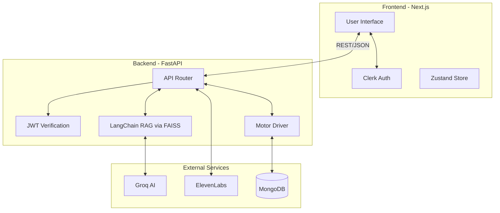
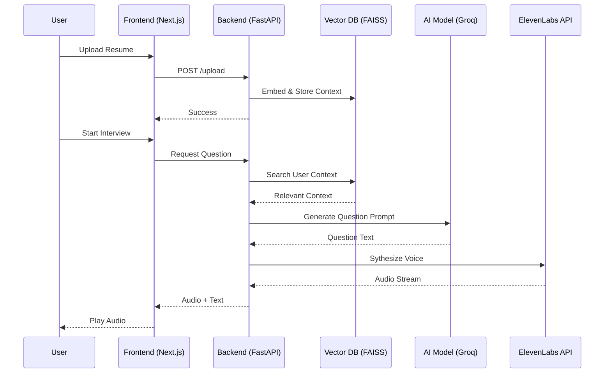

<div align="center">
  <h1>🎯 InterviewIQ</h1>
  <p><strong>AI-Powered Mock Interview Platform with Real-Time Voice and RAG</strong></p>
  
  [](#)
  [](https://opensource.org/licenses/MIT)
  [](#)
  [](#)
</div>

---

## 📑 Table of Contents
- [Overview](#-overview)
- [Features](#-features)
- [Tech Stack](#-tech-stack)
- [Architecture](#-architecture)
- [Workflow / How It Works](#-workflow--how-it-works)
- [Project Structure](#-project-structure)
- [Getting Started](#-getting-started)
  - [Prerequisites](#prerequisites)
  - [Installation](#installation)
  - [Environment Variables](#environment-variables)
  - [Running Locally](#running-locally)
  - [Running with Docker](#running-with-docker)
- [API Reference](#-api-reference)
- [Screenshots / Demo](#-screenshots--demo)
- [Deployment Guide](#-deployment-guide)
- [Contributing](#-contributing)
- [License](#-license)
- [Contact / Author](#-contact--author)

---

## 🚀 Overview
InterviewIQ is a cutting-edge AI-powered platform designed to help professionals practice and perfect their interview skills. By analyzing user resumes with RAG (Retrieval-Augmented Generation) and leveraging large language models (LLMs) via Groq, it curates highly relevant interview questions. Additionally, integration with ElevenLabs provides realistic voice interactions, simulating a genuine interview experience to give users actionable feedback and confidence.

---

## ✨ Features
**🧠 AI-Powered Insights**
* Resume Parsing and Context Extraction via FAISS & Langchain
* Dynamic, real-time question generation tailored to candidate experience with Groq

**🎤 Voice Interaction**
* Real-time Text-to-Speech (TTS) using ElevenLabs for an immersive interview simulation
* Hands-free voice-to-text integration for user responses

**🔐 Secure & Scalable**
* Seamless user authentication and session management via Clerk
* Blazing-fast backend with FastAPI and asynchronous operations

**📊 Performance Tracking**
* In-depth performance analytics and actionable feedback on answers
* Comprehensive metric dashboards powered by Recharts

---

## 🛠 Tech Stack

| Technology | Purpose | Version |
| :--- | :--- | :--- |
| **Next.js** | Frontend UI & Routing | `16.2.1` |
| **Tailwind CSS** | Styling & UI Framework | `4.0.0` |
| **React** | Component Rendering | `19.2.4` |
| **Zustand** | Global State Management | `5.0.12` |
| **Clerk** | Authentication | `7.0.7` |
| **FastAPI** | Backend API & async operations | `0.111.0` |
| **MongoDB (Motor)** | Async NoSQL Database | `3.4.0` |
| **LangChain + FAISS** | RAG Pipeline and Vector DB | `0.2.0` |
| **Groq API** | High-speed LLM inference | `Latest` |
| **ElevenLabs** | TTS Voice Synthesis | `1.2.0` |

---

## 🏗 Architecture



---

## 🛣 Workflow / How It Works

1. **Authentication:** User logs in securely via Clerk.
2. **Setup Phase:** User uploads their resume (PDF).
3. **Parsing & Vectorization:** The FastAPI backend extracts text, splices it into chunks via Langchain, and embeds the context into a FAISS vector database.
4. **Mock Interview:** The system leverages Groq and the embedded resume data to formulate industry-relevant questions.
5. **Speech Synthesis:** Generated questions are sent to ElevenLabs to be spoken aloud to the candidate.
6. **Evaluation:** The candidate's recorded responses are evaluated, scored, and stored in MongoDB to track progress over time.



---

## 📂 Project Structure

```text
InterviewIQ/
├── backend/                  # FastAPI Backend Application
│   ├── models/               # Pydantic schema and MongoDB models
│   ├── routes/               # API endpoint definitions (auth, voice, parsing)
│   ├── services/             # Core business logic (RAG, Groq, ElevenLabs)
│   ├── prompts/              # LLM system prompts
│   ├── main.py               # FastAPI entry point
│   ├── config.py             # Environment configurations
│   ├── database.py           # MongoDB connection logic
│   └── requirements.txt      # Python dependencies
├── frontend/                 # Next.js 14 Frontend Application
│   ├── app/                  # App router (pages, layout, routing)
│   ├── components/           # Reusable UI components
│   ├── lib/                  # Utility functions
│   ├── store/                # Zustand state management
│   ├── types/                # TypeScript interface definitions
│   ├── package.json          # Node dependencies and scripts
│   └── tailwind.config.ts    # Tailwind styles configuration
└── README.md                 # Project Documentation
```

---

## 🏁 Getting Started

### Prerequisites
* **Node.js** (v18 or higher)
* **Python** (v3.10 or higher)
* **MongoDB** (Local or Atlas instance)
* Accounts for **Clerk**, **Groq**, and **ElevenLabs**

### Installation

1. **Clone the repository:**
   ```bash
   git clone https://github.com/YourUsername/your-repo.git
   cd InterviewIQ
   ```

2. **Install Frontend Dependencies:**
   ```bash
   cd frontend
   npm install
   ```

3. **Install Backend Dependencies:**
   ```bash
   cd ../backend
   python -m venv venv
   source venv/bin/activate  # On Windows: .\venv\Scripts\activate
   pip install -r requirements.txt
   ```

### Environment Variables
Configure the following in `frontend/.env.local` and `backend/.env`.

| Variable | Description | Example |
| :--- | :--- | :--- |
| `NEXT_PUBLIC_CLERK_PUBLISHABLE_KEY` | Clerk Auth Public Key | `pk_test_...` |
| `CLERK_SECRET_KEY` | Clerk Auth Secret Key | `sk_test_...` |
| `MONGO_URI` | MongoDB Connection String | `mongodb://localhost:27017` |
| `GROQ_API_KEY` | Groq LLM API Key | `gsk_...` |
| `ELEVENLABS_API_KEY` | Speech Synthesis Key | `sk_...` |

### Running Locally

1. **Start the Frontend (from `/frontend`):**
   ```bash
   npm run dev
   # Runs on http://localhost:3000
   ```

2. **Start the Backend (from `/backend`):**
   ```bash
   uvicorn main:app --reload --host 0.0.0.0 --port 8000
   # Runs API on http://localhost:8000
   ```

### Running with Docker
*(Coming soon)*
```bash
docker-compose up --build
```

---

## 🔌 API Reference

| Method | Endpoint | Description | Auth Required |
| :--- | :--- | :--- | :--- |
| `GET` | `/api/health` | Health check route | No |
| `POST` | `/api/auth/verify` | Verifies JWT user token | Yes |
| `POST` | `/api/upload/resume` | Uploads and vectorizes resume PDF | Yes |
| `GET` | `/api/interview/question` | Returns a contextual question with audio | Yes |
| `POST` | `/api/interview/evaluate` | Evaluates given candidate answer | Yes |

---

## 📸 Screenshots / Demo

<div align="center">
  
  <p><em>Candidate Performance Dashboard</em></p>
  
  
  <p><em>Active Interview Flow</em></p>
</div>

---

## ☁️ Deployment Guide

### Render (Unified Deployment - Recommended)

This project is configured for unified deployment on Render using Docker:

1. **Push your repository to GitHub**

2. **Create a new Web Service on Render:**
   - Go to [Render Dashboard](https://dashboard.render.com/)
   - Click "New" → "Web Service"
   - Connect your GitHub repository

3. **Configure the service:**
   - **Environment:** Docker
   - **Dockerfile Path:** `./Dockerfile`
   - **Instance Type:** Free tier works, but Starter ($7/mo) recommended for production

4. **Add Environment Variables:**
   ```
   # Backend
   GROQ_API_KEY=your_groq_api_key
   MONGODB_URL=mongodb+srv://...
   MONGODB_DB_NAME=interviewiq
   CLERK_SECRET_KEY=sk_...
   CLERK_JWT_PUBLIC_KEY=-----BEGIN PUBLIC KEY-----...
   ELEVENLABS_API_KEY=your_elevenlabs_key
   ELEVENLABS_VOICE_ID=your_voice_id
   ENVIRONMENT=production
   FRONTEND_URL=https://your-app.onrender.com
   
   # Frontend (prefix with NEXT_PUBLIC_ for client-side)
   NEXT_PUBLIC_CLERK_PUBLISHABLE_KEY=pk_...
   NEXT_PUBLIC_API_URL=https://your-app.onrender.com
   ```

5. **Deploy:** Click "Create Web Service" and Render will build and deploy automatically.

> **Note:** The first deploy may take 10-15 minutes as it builds both the frontend and backend.

### Alternative: Separate Deployments

#### Vercel (Frontend)
1. Push your repository to GitHub.
2. Link the repository to your Vercel account.
3. Configure the `Build Command` as `npm run build` and root directory as `frontend`.
4. Ensure all environment variables are added under project settings.

#### Render / Railway (Backend)
1. Create a Web Service instance.
2. Link the GitHub repository and set the root directory to `backend`.
3. Set Start Command to `uvicorn main:app --host 0.0.0.0 --port $PORT`.
4. Add your `.env` configuration in the dashboard.

---

## 🤝 Contributing
Contributions make the open source community such an amazing place to learn, inspire, and create. Any contributions you make are **greatly appreciated**.

1. Fork the Project
2. Create your Feature Branch (`git checkout -b feature/AmazingFeature`)
3. Commit your Changes (`git commit -m 'Add some AmazingFeature'`)
4. Push to the Branch (`git push origin feature/AmazingFeature`)
5. Open a Pull Request

---

## 📜 License
Distributed under the MIT License. See `LICENSE` for more information.

---

## 📫 Contact / Author
**Your Name**  
* GitHub: [@YourUsername](https://github.com/YourUsername)
* LinkedIn: [Your/Name](https://linkedin.com/in/yourprofile)
* Email: you@example.com

<p align="right"><a href="#top">⬆️ Back to Top</a></p>
